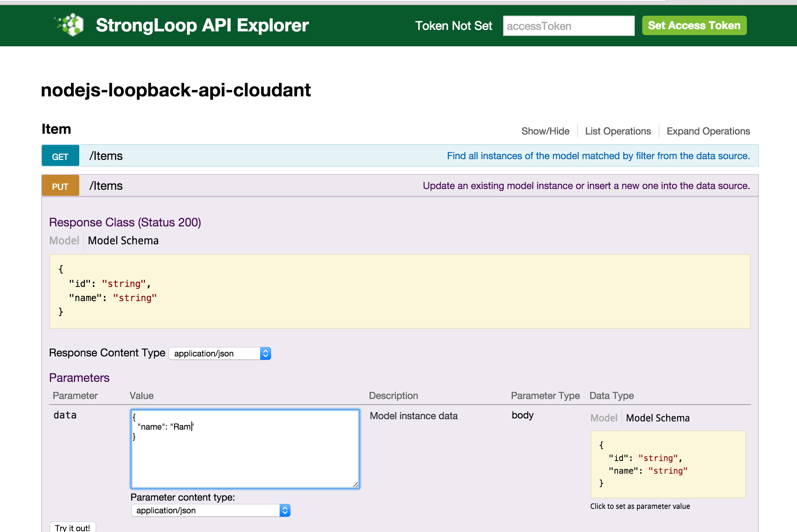

# nodejs-loopback-api-cloudant Overview

A simple API using StrongLoop Loopback backed by a Cloudant database. Create an RESTful API in minutes and Create, Read, Update and Delete (CRUD) data, complete with a swagger dashbaord.

This projects lets you run your loopback node.js application on Bluemix with a Cloudant database

[](https://bluemix.net/deploy)




This application is designed to be used as a microservice. You can reuse this application in combination with to other application(s) to manage any json data. For example, you might have a front end UI application written in any language and you can use this API as your backend. You can also use this application as part of your mobile solution. 

## Let's get started!

1. If you do not already have a Bluemix account, [sign up here][bluemix_signup_url]

2. Download and install the [Cloud Foundry CLI][cloud_foundry_url] tool

3. Clone the app to your local environment from your terminal using the following command:

  ```
  git clone https://github.com/IBM-Bluemix/nodejs-loopback-api-cloudant.git
  ```

4. `cd` into this newly created directory

5. Open the `manifest.yml` file and change the `host` value to something unique.

  The host you choose will determinate the subdomain of your application's URL:  `<host>.mybluemix.net`

6. Connect to Bluemix in the command line tool and follow the prompts to log in

  ```
  $ cf api https://api.ng.bluemix.net
  $ cf login
  ```

7. Create the Cloudant service in Bluemix

  ```
  $ cf create-service cloudantNoSQLDB Shared loopback-db
  ```

11. Push the app to Bluemix.

  ```
  $ cf push
  ```

And voila! You now have your very own REST API! at YOURAPPNAME.mybluemix.net/api/Items . You can use the API Explorer to easily insert, delete, or update items: YOURAPPNAME.mybluemix.net/explorer

## Troubleshooting

The primary source of debugging information for your Bluemix app is the logs. To see them, run the following command using the Cloud Foundry CLI:

  ```
  $ cf logs realtime-tone --recent
  ```
For more detailed information on troubleshooting your application, see the [Troubleshooting section](https://www.ng.bluemix.net/docs/troubleshoot/tr.html) in the Bluemix documentation.

## Contribute
We are more than happy to accept external contributions to this project, be it in the form of issues and pull requests. If you find a bug, please report it via the [Issues section][issues_url] or even better, fork the project and submit a pull request with your fix! Pull requests will be evaulated on an individual basis based on value add to the sample application.

## Privacy Notice
The capital-weather sample web application includes code to track deployments to Bluemix and other Cloud Foundry platforms. The following information is sent to a [Deployment Tracker](https://github.com/cloudant-labs/deployment-tracker) service on each deployment:

* Application Name (application_name)
* Space ID (space_id)
* Application Version (application_version)
* Application URIs (application_uris)

This data is collected from the VCAP_APPLICATION environment variable in IBM Bluemix and other Cloud Foundry platforms. This data is used by IBM to track metrics around deployments of sample applications to IBM Bluemix. Only deployments of sample applications that include code to ping the Deployment Tracker service will be tracked.

### Disabling Deployment Tracking

Deployment tracking can be disabled by removing `require("cf-deployment-tracker-client").track();` from the beginning of the `app.js` file.


[speech_service_url]: http://www.ibm.com/smarterplanet/us/en/ibmwatson/developercloud/speech-to-text.html
[speech_service_bluemix_url]: https://console.ng.bluemix.net/catalog/services/speech-to-text/
[tone_service_url]: http://www.ibm.com/smarterplanet/us/en/ibmwatson/developercloud/tone-analyzer.html
[tone_service_bluemix_url]: https://console.ng.bluemix.net/catalog/services/tone-analyzer/
[bluemix_url]: http://ibm.biz/realtime-tone-bluemix
[bluemix_signup_url]: http://ibm.biz/realtime-tone-signup
[cloud_foundry_url]: https://github.com/cloudfoundry/cli
[download_node_url]: https://nodejs.org/download/
[browserify_url]: http://browserify.org/
[issues_url]: https://github.com/IBM-Bluemix/real-time-tone-analysis/issues
